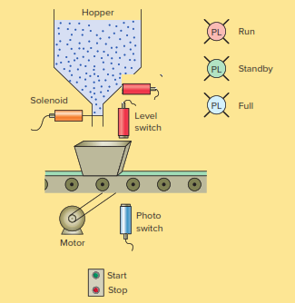

# Automatic And Continues Feeding Box

## Function

Its a process of continue and automatic feeding box. the process require that conveyor moves the box and automatic stop on the dispenser

### PLC Inputs

- Level box sensor (High level Normally Open)
- Position box sensor (Box position on the conveyor Normally Open)
- Level hopper sensor (Low level Normally Open)
- Push button START
- Push button STOP

### PLC Outputs

- Motor conveyor
- Solenoid (Dispenser)
- Run pilot indicator (Green light)
- Standby pilot indicator (Yellow light)
- Full box pilot indicator (Blue light)

### Process Model

### Initial conditions to start process

The process start when start pushbutton is powered, the process only start if hopper level isnt low, when hopper level is low the process stop.
